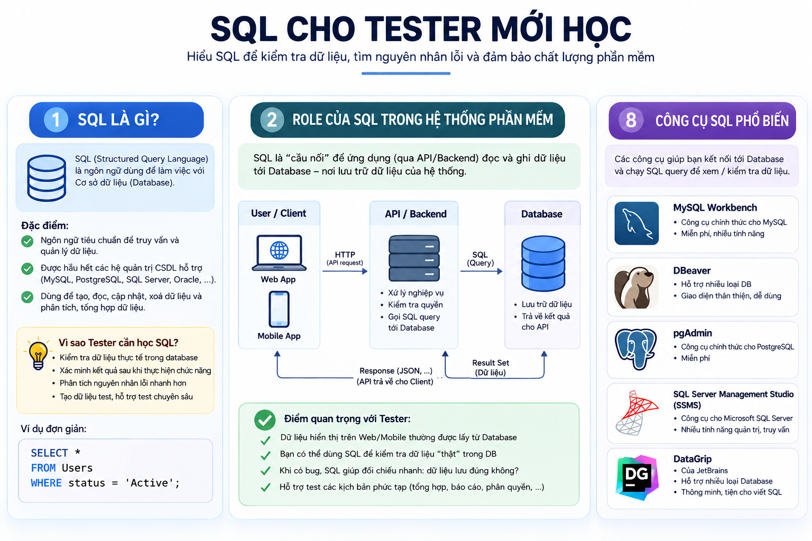
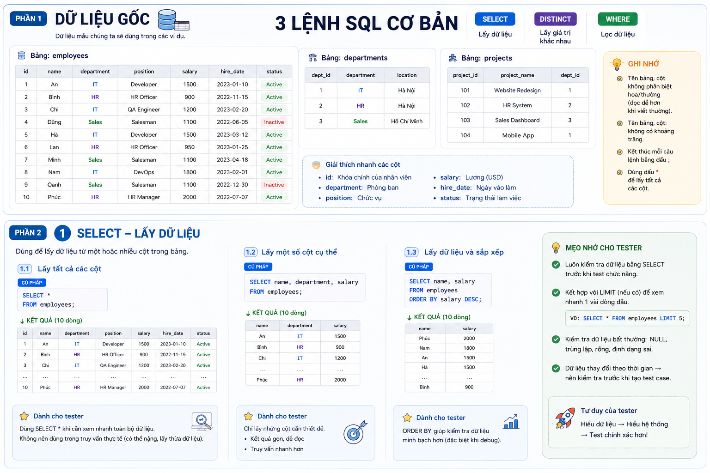
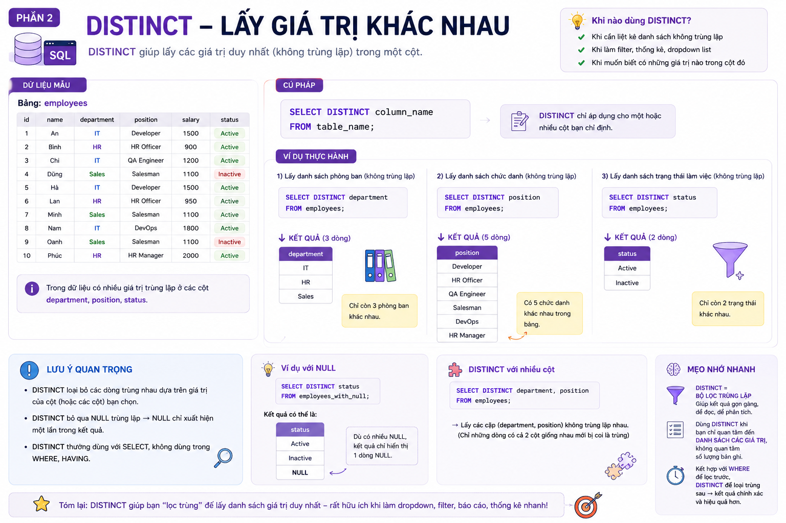
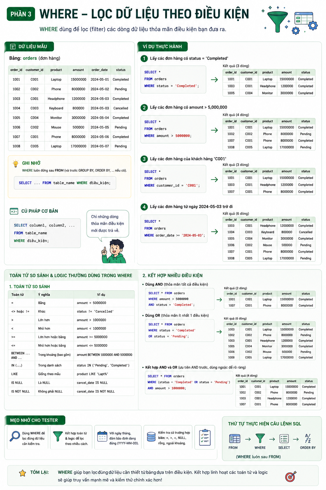
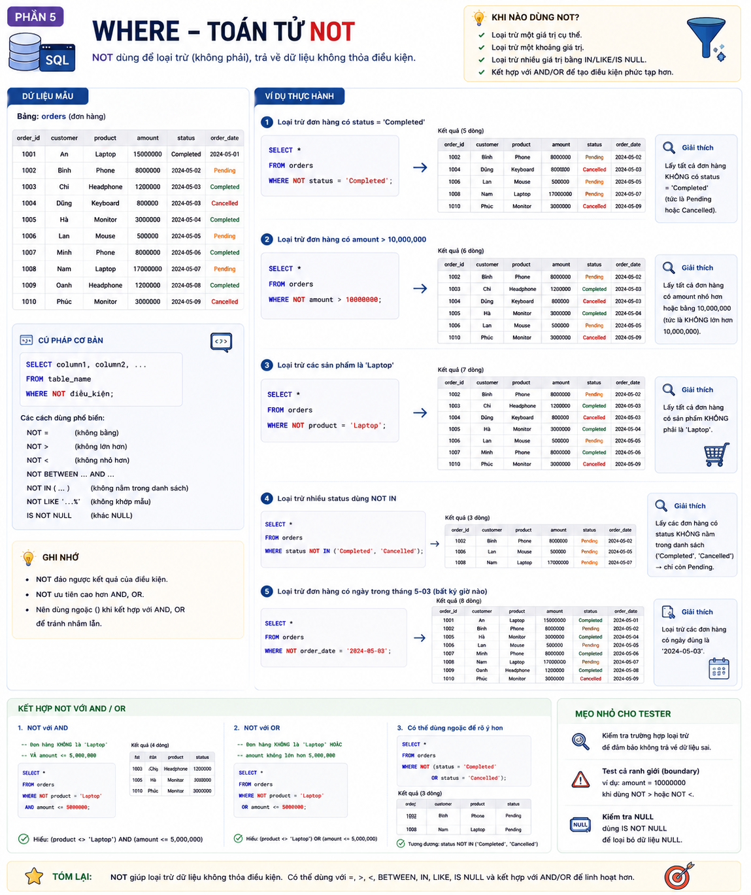

# 📚 MySQL Study Notes

## 0. Nguồn tham khảo (References)
- https://www.w3schools.com/sql/default.asp
- https://sqlbolt.com/
- https://leetcode.com/studyplan/top-sql-50/

---

## 📑 Table of Contents
- [0. Nguồn tham khảo (References)](#0-nguồn-tham-khảo-references)
- [Tổng quan: SQL cho Tester mới học](#tổng-quan-sql-cho-tester-mới-học)
- [1. Các lệnh SQL cơ bản (Phần 1)](#1-các-lệnh-sql-cơ-bản-phần-1)
  - [1.1. SELECT – Lấy dữ liệu](#11-select--lấy-dữ-liệu)
  - [1.2. DISTINCT – Lấy giá trị khác nhau](#12-distinct--lấy-giá-trị-khác-nhau)
  - [1.3. WHERE – Lọc dữ liệu theo điều kiện](#13-where--lọc-dữ-liệu-theo-điều-kiện)
  - [1.4. WHERE – Kết hợp điều kiện với AND, OR](#14-where--kết-hợp-điều-kiện-với-and-or)
  - [1.5. WHERE – Toán tử NOT](#15-where--toán-tử-not)

---

## Tổng quan: SQL cho Tester mới học

**📌 Overview:**
- **SQL (Structured Query Language)** là ngôn ngữ tiêu chuẩn dùng để làm việc với Cơ sở dữ liệu (Database). Nó dùng để tạo, đọc, cập nhật, xoá và phân tích dữ liệu.
- Được hỗ trợ bởi hầu hết các hệ quản trị CSDL (MySQL, PostgreSQL, SQL Server, Oracle,...).

**💡 Ứng dụng:**
- Giúp kiểm tra dữ liệu thực tế đang lưu trong database.
- Xác minh kết quả chính xác sau khi thao tác chức năng trên UI.
- Phân tích nguyên nhân lỗi nhanh hơn (VD: Lỗi do Backend xử lý sai hay do Database lưu sai?).
- Hỗ trợ tạo dữ liệu test và test các kịch bản chuyên sâu.
- Khi có bug, SQL giúp đối chiếu nhanh chóng xem dữ liệu lưu có đúng như mong muốn không.
- Hỗ trợ đắc lực khi test các kịch bản phức tạp (thống kê tổng hợp, báo cáo, phân quyền,...).

---

## 1. Các lệnh SQL cơ bản (Phần 1)

### 1.1. SELECT – Lấy dữ liệu
**📌 Overview:**
- Dùng để lấy dữ liệu từ một hoặc nhiều cột trong bảng.
- Có thể dùng `SELECT *` để lấy tất cả các cột, hoặc chỉ định tên các cột cụ thể.
- Có thể kết hợp với `ORDER BY` để sắp xếp dữ liệu trả về (tăng dần hoặc giảm dần).

---

### 1.2. DISTINCT – Lấy giá trị khác nhau
**📌 Overview:**
- Giúp lấy các giá trị duy nhất (không trùng lặp) trong một hoặc nhiều cột do bạn chỉ định.
- `DISTINCT` loại bỏ các dòng trùng nhau. Nếu có nhiều giá trị `NULL`, `DISTINCT` cũng gộp lại và `NULL` chỉ xuất hiện 1 lần trong kết quả.
- Thường đứng ngay sau `SELECT`, không dùng trong `WHERE` hay `HAVING`.

**💡 Khi nào dùng:**
- Khi cần liệt kê danh sách không trùng lặp.
- Rất hữu ích khi làm chức năng filter (bộ lọc), bảng thống kê, hoặc đổ dữ liệu cho dropdown list.
- Khi muốn khảo sát xem có những giá trị nào đang tồn tại trong một cột cụ thể.
- Đóng vai trò như một "bộ lọc trùng lặp" giúp kết quả gọn gàng, dễ đọc và dễ phân tích dữ liệu hơn.

---

### 1.3. WHERE – Lọc dữ liệu theo điều kiện
**📌 Overview:**
- Dùng để lọc (filter) các dòng dữ liệu thỏa mãn điều kiện đưa ra (chỉ những dòng thỏa mãn điều kiện mới được trả về).
- Vị trí: Luôn đứng sau `FROM` (và đứng trước `GROUP BY`, `ORDER BY` nếu có).
- Hỗ trợ nhiều toán tử so sánh (`=`, `<>`, `>`, `<`, `BETWEEN`, `IN`, `LIKE`, `IS NULL`) và có thể kết hợp nhiều điều kiện bằng toán tử logic (`AND`, `OR`).

**💡 Khi nào dùng:**
- Dùng `WHERE` để lọc ra đúng tập dữ liệu cần thiết phục vụ cho việc kiểm tra (test).
- Nên kết hợp toán tử và logic theo nhiều cách để bao phủ các kịch bản test.
- Với dữ liệu ngày tháng, luôn đảm bảo định dạng đúng (thường là `YYYY-MM-DD`).
- **Kiểm tra các trường hợp biên:** Cần chú ý test với các điều kiện `=`, `>`, `<`, `NULL`, rỗng, hoặc các giá trị nằm ngoài khoảng giới hạn.
- **Thứ tự thực hiện câu lệnh SQL (Cực kỳ quan trọng để hiểu luồng):** `FROM` $\rightarrow$ `WHERE` $\rightarrow$ `SELECT` $\rightarrow$ `ORDER BY`.

---

### 1.4. WHERE – Kết hợp điều kiện với AND, OR
**Overview:**
- Dùng để lọc dữ liệu theo nhiều điều kiện cùng lúc để tìm đúng tập dữ liệu bạn cần.
- **AND:** Trả về kết quả khi **tất cả** các điều kiện đều phải đúng.
- **OR:** Trả về kết quả khi **chỉ cần một** trong các điều kiện đúng.
- **Thứ tự ưu tiên toán tử trong WHERE:** 
  1. Dấu ngoặc `()`
  2. Toán tử `AND`
  3. Toán tử `OR`
- Toán tử `AND` luôn được ưu tiên xử lý trước `OR`. Do đó, nên dùng dấu ngoặc `()` để nhóm các điều kiện lại, giúp kiểm soát thứ tự ưu tiên và đảm bảo logic kết hợp được tính toán chính xác.

**Khi nào dùng:**
- Dùng `AND` khi muốn thu hẹp kết quả (yêu cầu khắt khe hơn).
- Dùng `OR` khi muốn mở rộng kết quả (chấp nhận nhiều trường hợp khác nhau).
- Cần kiểm tra kỹ các giá trị biên (như `>`, `<`, `=`, `BETWEEN`).
- Luôn phải nhớ kiểm tra các trường hợp dữ liệu chứa `NULL` (xem xét dùng `IS NULL` hoặc `IS NOT NULL`).
- Nên kết hợp với `ORDER BY` để xem kết quả gọn gàng, giúp đối chiếu và kiểm tra dễ dàng hơn.

---

### 1.5. WHERE – Toán tử NOT
**Overview:**
- `NOT` dùng để loại trừ (không phải), đảo ngược kết quả của một điều kiện và trả về các dòng dữ liệu **không** thỏa mãn điều kiện đó.
- Các cách kết hợp phổ biến: `NOT IN (...)` (không nằm trong danh sách), `NOT LIKE` (không khớp mẫu), `IS NOT NULL` (khác NULL), `NOT BETWEEN`, `NOT =`, `NOT >`, `NOT <`.
- `NOT` có độ ưu tiên cao hơn `AND` và `OR`.
- Nên sử dụng dấu ngoặc `()` khi kết hợp `NOT` với `AND`, `OR` trong cùng một câu lệnh để tránh sự nhầm lẫn về mặt logic (Ví dụ: `WHERE NOT (status = 'Completed' OR status = 'Cancelled')`).

**Khi nào dùng:**
- Dùng để loại trừ một giá trị cụ thể hoặc một khoảng giá trị không mong muốn.
- Rất hiệu quả khi cần loại trừ nhiều giá trị cùng lúc bằng cách kết hợp với `IN`, `LIKE`, hoặc loại các dòng thiếu dữ liệu bằng `IS NOT NULL`.
- Kết hợp linh hoạt với `AND`/`OR` để tạo ra các kịch bản lọc phức tạp.
- Khi sử dụng cần chú ý kiểm tra các trường hợp loại trừ để đảm bảo không trả về dữ liệu sai.
- Cực kỳ chú ý test các ranh giới (boundary), ví dụ như khi dùng `NOT >` hoặc `NOT <` cần kiểm tra xem giá trị tại đúng ranh giới đó (như `amount = 10000000`) có bị loại bỏ sai hay không.

